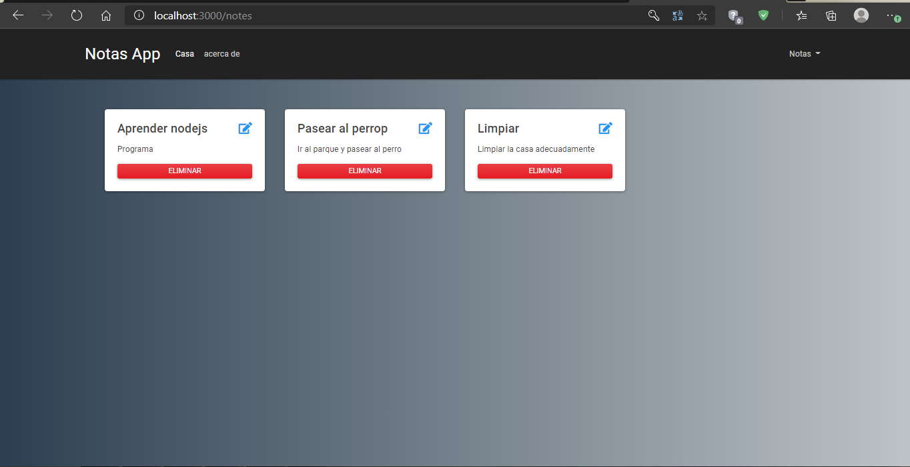

# node-MongoDB-CRUD-de-notas-registro-login-CRUD-ES6+
This is a basic App to manage simple Notes on the web using Javascript Technologies like Nodejs, Mongodb, and so on.
This app can:
- create/read/update/delete Notes
- Allows a user to do log in and save his personal notes

# Screenshot


# Environment Variables
This app needs the following environment Variables
* `MONGODB_HOST` this is the Mongodb URI string
* `MONGODB_DATABASE` Mongodb database name
* `NODE_ENV` node environment

# Docker
you can run a container for development
```
npm install 
docker-compose up 
```

